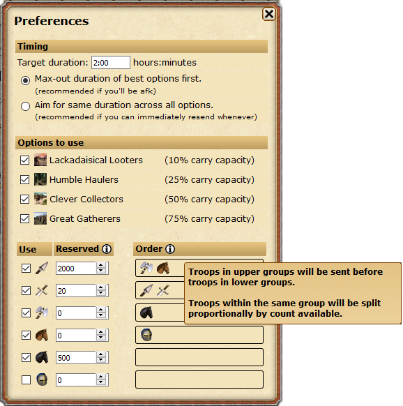

# Another Scavenging Script

Use this at the scavenging screen. 

```javascript
javascript:
(window.TwCheese && TwCheese.tryUseTool('ASS'))
|| $.ajax('https://cheesasaurus.github.io/twcheese/launch/ASS.js?'
+~~((new Date())/3e5),{cache:1,dataType:"script"});void 0;
```

## What it does

1. Fills in troops to scavenge
2. Focuses the start button of the option your troops are intended to be used for

Behavior is configurable.\


Also spawns an expandable sidebar:\


The bug reporter will run you through some Q&A and collect debug information.\
**Information is only collected if you report a bug.**


## Distributable
It's suboptimal, but if you want everything in one file, here it is:\
https://cheesasaurus.github.io/twcheese/dist/tool/ASS.js

## Contributing
Bugfixes & maintainence are welcome.\
https://github.com/cheesasaurus/twcheese/tree/develop/docs/developer

Fork it, make your changes, then submit a pull request.\
If the tests don't pass: either fix your "fix", or update the tests.
