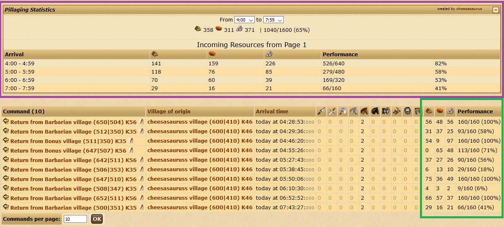

# Overview of Hauls

Use this on the commands overview, with the "Return" filter.

```javascript
javascript:
(window.TwCheese && TwCheese.tryUseTool('OverviewHauls'))
|| $.ajax('https://cheesasaurus.github.io/twcheese/launch/OverviewHauls.js?'
+~~((new Date())/3e5),{cache:1,dataType:"script"});void 0;
```

## What it does

1. Loads haul information for each command. (shown below in green)
2. Creates a summary of incoming hauls, hour-by-hour. (shown below in purple)



Also spawns an expandable sidebar:\


The bug reporter will run you through some Q&A and collect debug information.\
**Information is only collected if you report a bug.**


## Distributable
It's suboptimal, but if you want everything in one file, here it is:\
https://cheesasaurus.github.io/twcheese/dist/tool/OverviewHauls.js

## Contributing
Bugfixes & maintainence are welcome.\
https://github.com/cheesasaurus/twcheese/tree/develop/docs/developer

Fork it, make your changes, then submit a pull request.\
If the tests don't pass: either fix your "fix", or update the tests.
